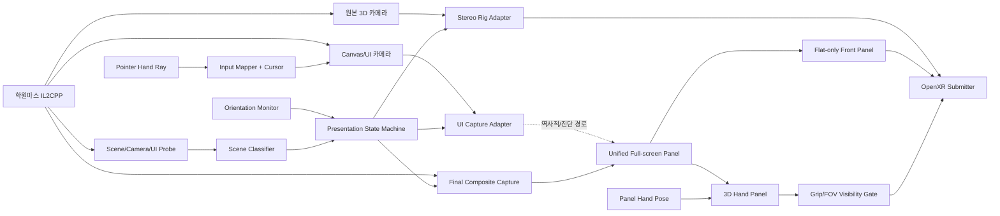
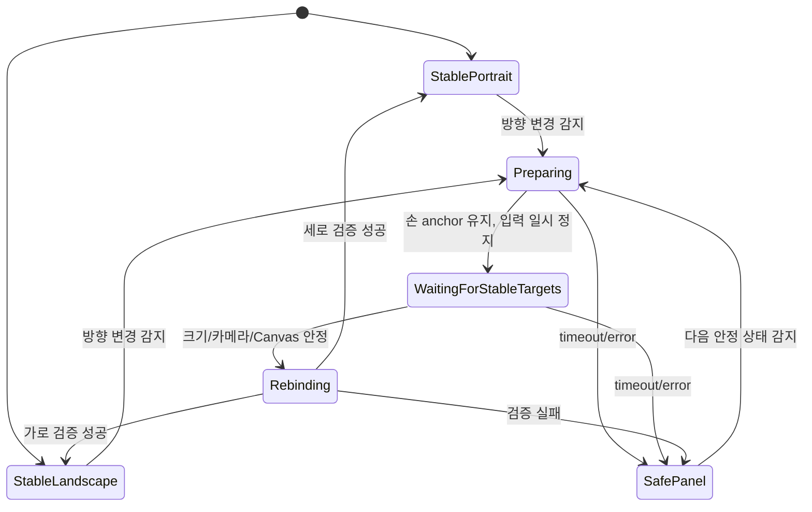

# 학원 아이돌마스터 VR 모드 기술 설계

상태: 구현 설계 — v0.173 M7 설정·설치·자동 업데이트·6DoF 조작 사용자 실기 완료, 정식 릴리스 기준

현재 설치/검증/결함 상태는 [`GAKUMAS_VR_STATUS.md`](GAKUMAS_VR_STATUS.md), 단계별 완료 조건과 알림 규칙은 [`VR_MILESTONES.md`](VR_MILESTONES.md)를 기준으로 한다. 이 문서는 목표 구조와 확정된 기술 결정을 설명한다. 작업 문서는 마일스톤 완료 시점 또는 사용자의 명시적 문서 요청에서 동기화한다.

대상 환경:

- Windows 11, x64
- Unity 6000.0.77f1, IL2CPP metadata 31.1, Direct3D 11, URP
- Meta Quest 계열 HMD
- Virtual Desktop OpenXR 우선
- SteamVR OpenXR, Meta Quest Link OpenXR 예비 지원
- 기존 `Gakumas Localify` 한글 패치와 동시 사용

## 1. 목표

게임의 원래 진행과 2D 조작성을 유지하면서 지원되는 실시간 3D 장면을 6DoF VR로 표현한다.

이 게임은 세로 UI, 가로 UI, 실시간 3D, 다중 카메라, 사전 렌더 영상 및 WebView가 혼재한다. 모든 VR 환경에서 최종 게임 화면 전체를 동일한 backbuffer source로 유지하되, 완전 평면 문맥에서는 시야 정면 패널로 자동 표시하고 검증된 실시간 3D에서는 세계를 몰입형 스테레오로 승격하면서 왼손 보조 패널을 선택적으로 표시한다.

1. **패널 모드**: 원본 최종 합성 화면 전체를 HMD 시야 정면의 선명한 2D 패널로 자동 표시한다.
2. **몰입 모드**: 3D 세계는 양안 스테레오로 렌더링하고, 동일한 전체 화면 source를 왼손 Grip 보조 패널로 필요할 때 표시한다.

어떤 장면에서도 패널 모드로 즉시 복귀할 수 있어야 한다. 게임 데이터, 네트워크 요청, 계정 정보 및 플레이 규칙은 변경하지 않는다.

## 2. 설계 원칙

- 원본 `version.dll`, `GameAssembly.dll`, 게임 에셋을 수정하지 않는다.
- OpenXR 세션과 HMD swapchain은 화면 방향이 바뀌어도 유지한다.
- 세로/가로 변경은 VR 패널의 종횡비와 입력 좌표계 변경으로 처리한다.
- 라이브를 포함한 모든 VR 환경에서 최종 게임 백버퍼 전체를 공통 평면 패널 source로 유지한다. UI black-key나 장면별 UI 추출은 제품 기본 경로로 사용하지 않는다.
- 기본 패널 손은 왼손, 기본 포인터 손은 오른손이다. 두 역할과 관련 버튼은 설정 GUI에서 교환할 수 있다.
- 완전 평면 문맥의 정면 패널은 주 콘텐츠이므로 자동 표시하며 Grip 토글이나 손 추적에 의존하지 않는다.
- stereo 문맥의 보조 패널은 패널 손의 유효한 추적 pose가 HMD 시야 안에 있을 때만 표시한다. 시작 시 비활성이고 패널 손 Grip의 명확한 press edge로 ON/OFF를 토글한다. OFF 상태에서는 swapchain을 파괴하지 않되 백버퍼 복사, panel swapchain acquire/write, quad 제출과 포인터 hit-test를 모두 생략한다.
- 원본 게임 카메라에는 HMD 자세를 직접 기록하지 않는다.
- 몰입 모드는 검증된 장면만 화이트리스트로 허용한다.
- UI 분리에 실패하거나 카메라 구성이 불명확하면 패널 모드로 폴백한다.
- HMD가 없거나 OpenXR 초기화에 실패하면 일반 창모드 게임이 정상 실행되어야 한다.
- Localify의 번역, 폰트, 텍스처 교체 및 ImGui를 우선 보존한다.

### 2.1 v0.173 6DoF 조작·roll 불변식

- 기본 입력 역할은 왼손 world-axis 시야 회전, 오른손 final-view 3D 이동이며 설정의 `locomotionHand`로 교체한다. VR 스틱 스크롤은 항상 비활성화한다.
- artificial yaw/pitch는 scalar로 따로 누적한다. 스틱 대각 오차는 절댓값이 큰 한 축만 선택하며 기본 snap은 15°, 활성 임계값 0.65, deadzone 재무장은 0.20이다.
- scene base rotation은 forward에서 yaw/pitch만 추출하고 roll을 폐기한다. OpenXR absolute eye orientation은 Unity 좌표로 바꾼 뒤 yaw/pitch/roll을 각각 원점과 비교한다.
- 최종 회전은 `Yaw(base + artificial + physical delta) × Pitch(base + artificial + physical delta) × Roll(physical delta)`로 매 프레임 재구성한다. 따라서 스틱·scene·진입 자세에서 roll이 유입되지 않고 사용자가 실제로 HMD를 기울인 변화량만 남는다.
- raw relative HMD quaternion을 artificial quaternion에 통째로 곱하지 않는다. 기울어진 origin에서 physical yaw가 relative roll로 표현되어 수평선이 기울 수 있기 때문이다.
- 물리 머리 위치, 눈 offset, controller locomotion offset은 동일한 roll-free world navigation basis를 쓴다. 이동 벡터에서 pitch를 제거하지 않으므로 위·아래 시야 전진은 상승·하강으로 이어진다.
- 전체 수학·상태기·패널·폴백·이식 경계는 공개 명세 [`ko/VR_INTERACTION_SPEC.md`](ko/VR_INTERACTION_SPEC.md)를 권위 문서로 사용한다.

## 3. 전체 구조



### 주요 모듈

| 모듈 | 책임 |
|---|---|
| `RuntimeSelector` | 활성 OpenXR 런타임과 필수 확장 기능 확인 |
| `CompatibilityGuard` | 게임/Unity/Localify 버전 및 그래픽 API 검사 |
| `SceneProbe` | 활성 Scene, Camera, URP stack, Canvas, RenderTexture 수집 |
| `SceneClassifier` | 장면을 패널/몰입/강제 폴백으로 분류 |
| `OrientationMonitor` | 게임 이벤트, 실제 화면 크기, RenderTarget 변경 감시 |
| `PresentationStateMachine` | 전환 순서, 페이드, 재바인딩, 실패 복구 관리 |
| `StereoRigAdapter` | 원본 카메라 동작에 HMD 자세를 가산해 양안 렌더링 |
| `UICaptureAdapter` | 역사적 live UI one-shot/진단 경로; 새 제품 기본 경로에서는 사용하지 않음 |
| `CompositeCapture` | 분리가 불가능한 경우 최종 게임 화면 전체 캡처 |
| `VRPanelRenderer` | 최종 백버퍼 전체를 flat-only 정면 pose 또는 stereo 문맥의 패널 손 pose에 표시 |
| `QuestInputMapper` | 포인터 손의 레이, 클릭, 드래그와 뒤로가기 입력 변환 |
| `Diagnostics` | 토큰을 제외한 전환·카메라·성능 로그 기록 |

### 현재 구현과 초기 설계의 차이

- BepInEx/Cpp2IL interop 대신 Doorstop .NET 6과 공개 IL2CPP export를 사용한다.
- Unity 메인 스레드 진입은 `Time.get_frameCount` icall의 Dobby hook으로 확보한다.
- D3D11 Present hook은 게임 프레임 경계와 GPU 완료 동기화에 사용한다.
- OpenXR는 게임 Unity XR 플러그인 내부가 아니라 별도 프레임 루프로 실행한다.
- 이 프레임 루프는 진단 시간/프레임 상한으로 종료하지 않는다. 활성 중 세션 이벤트를 계속 poll하고 `STOPPING`, `LOSS_PENDING`, `EXITING`에서만 정상 종료한다.
- 스테레오 카메라는 수동 `SubmitRenderRequestsInternal`로 반복 렌더하지 않는다. 이 경로는 게임의 조명/이펙트 전역 상태를 불완전하게 읽어 점멸을 발생시켰다.
- 현재 승인 경로는 clone 카메라를 Unity 정상 렌더 루프에 참여시키고, actual clone completion으로 완성된 양안 쌍을 확인한 뒤 세 개의 eye buffer pair를 lease-aware하게 순환하는 방식이다.
- v0.149는 OpenXR core Oculus Touch interaction profile로 좌·우 grip/aim pose와 squeeze/trigger/A·B/X·Y action을 만들고 session action set에 연결했다.
- v0.150은 right thumbstick vector action을 추가하고, fresh stereo가 없으면 `XR_VIEW_REFERENCE_SPACE` 정면 1.6m에 전체 백버퍼 패널을 자동 표시한다. fresh stereo가 있으면 정면 패널을 제거하고 v0.149의 왼손 Grip/FOV 보조 패널로 전환한다.
- v0.150은 right aim ray를 현재 패널 plane의 UV와 foreground 게임 client 좌표로 변환한다. 별도 alpha quad cursor, A click/drag, pre-press latch를 적용한 trigger click/drag와 B→Escape를 연결한다. v0.160 계열 설정 GUI에서 손 역할·버튼·패널 배치를 편집하며 직접 터치는 사용자 결정으로 제품 범위에서 제외했다. v0.170부터 VR 스틱 스크롤은 비활성이고 양 스틱을 이동과 시야 회전에 사용한다.
- v0.151은 OpenXR `XrActionStateGetInfo.Type`을 규격 값 58로 수정하고 액션 조회 실패를 개별 격리했다. 사용자 실기에서 ray cursor, A/trigger/B/stick과 Grip 토글이 정상 판정됐다.
- v0.154 손 패널은 왼손 controller local +Y 0.10m의 상단 끝을 view-space 위치로 변환해 그 지점에 중심을 둔다. quad는 view-space 수직을 유지하고 매 프레임 플레이어를 향한다. 표시 gate는 왼손 tracking과 HMD FOV이며 방향 고정/추종 선택은 M7 GUI 항목이다.

## 4. 런타임 선택

우선순위는 다음과 같다.

1. Virtual Desktop OpenXR
2. SteamVR OpenXR
3. Meta Quest Link의 Oculus OpenXR

OpenVR은 위 OpenXR 경로가 모두 실패했을 때만 별도 실험 빌드에서 사용한다. 실행 중 OpenXR 런타임을 자동 변경하지 않는다. 현재 활성 런타임이 지원 대상이 아니면 진단 메시지를 표시하고 VR만 비활성화한다.

런타임별 게임 코드는 분기하지 않고 다음 인터페이스로 격리한다.

```text
IXrBackend
  Initialize()
  PollEvents()
  LocateViews(predictedDisplayTime)
  AcquireEyeTextures()
  SubmitStereoLayers()
  SubmitQuadLayer()
  Recenter()
  Shutdown()
```

## 5. 표현 모드

### 5.1 패널 모드

검증된 실시간 3D source가 없는 모든 화면의 기본 모드다.

- 홈, 메뉴, 카드 선택, 설정
- 세로 중심 프로듀스 UI
- WebView
- 사전 렌더 영상
- 로딩 및 장면 전환
- 카메라 구성을 아직 검증하지 않은 장면

M5에서 확인된 source가 없거나 UI/video 분리가 불명확한 경우의 안전 기본값이다. v0.150은 fresh stereo texture가 없으면 최종 백버퍼를 `XR_VIEW_REFERENCE_SPACE` 기준 Z=-1.6m의 정면 quad로 자동 제출한다. 기존 stereo 프레임을 남기지 않으며 정면 패널이 실패한 경우에만 OpenXR opaque 환경의 검정 배경만 남는다.

원본 최종 합성 백버퍼를 매 Present마다 갱신해 OpenXR quad layer 또는 VR 공간 패널에 표시한다. 이 경로는 Localify, UI 애니메이션, 시계, 영상과 화면 전환을 최종 PC 출력과 동일하게 포함해야 한다.

정면 패널은 head-fixed이며 최대 1.8m x 1.3m 안에서 source 종횡비를 보존한다. stereo 문맥의 보조 패널은 왼손 controller 상단 끝(local +Y 0.10m)에 중심을 두고 최대 0.42m 크기를 사용한다. view-space에서 수직으로 플레이어를 향하며, 추적·HMD 손 FOV gate와 100ms 이탈 hysteresis를 적용한다. v0.154 배치는 사용자 실기로 승인됐고 크기·회전·viewer-facing 여부는 M7 GUI 설정으로 노출한다.

실제 콘텐츠 비율이 다르면 패널 외곽 크기는 유지하고 내부에 letterbox/pillarbox를 적용한다. 세로·가로 전환은 같은 손 anchor를 유지한 채 패널 종횡비와 content rect만 갱신한다.

### 5.2 몰입 모드

검증된 실시간 3D 커뮤와 라이브에서만 사용한다.

- 원본 카메라의 위치·회전·FOV·culling mask·URP 설정을 매 프레임 복제한다.
- 원본 카메라는 게임 로직과 모니터 출력을 위해 그대로 둔다.
- 좌/우 VR 카메라는 렌더링 전용이며 게임 스크립트가 참조하지 못하게 한다.
- HMD 자세는 연출 카메라에 상대적으로 가산한다.
- UI·영상·메뉴는 최종 백버퍼 전체를 담은 왼손 Grip 보조 패널로 표시한다. keyed UI-only alpha layer는 필수 제품 경로가 아니다.

### 5.3 비-live 화면 적용 정책

M5 실기에서 화면 이름만으로 immersive를 허용하지 않고 실제 렌더 topology를 기준으로 다음 정책을 확정했다.

| 문맥 | 확인된 topology | 개정된 M6 표시 정책 |
|---|---|---|
| 메인 홈 | `Game3DManager`의 `_VLTargetTexture_2160x3840`을 활성 `.../3dTargetImage` RawImage가 표시하고 홈 UI는 별도 `UICamera` Canvas를 사용한다. `HomeMonitor`는 768x768 RT/Canvas 경로다. | 활성 world-presenting RawImage와 source RT가 함께 유효할 때만 stereo world 후보. 조작과 UI 확인은 최종 백버퍼 전체 손 패널을 사용한다. |
| 진행 중 메뉴/선택 | UI-only 메뉴에서도 `Game3DManager`가 남을 수 있으며 Shop/Produce/Story 등 조작 Canvas는 주로 `UICamera` 기반이다. | camera 존재만으로 immersive를 허용하지 않는다. fresh stereo가 없으면 최종 백버퍼 정면 패널을 자동 표시하고, source가 실제 표시될 때만 stereo world와 선택형 손 패널로 전환한다. |
| 커뮤니케이션 | 가로 ADV는 `_VLTargetTexture_3840x2160`, 세로 ADV는 `_VLTargetTexture_2160x3840`을 `ADVEngine/.../Main Layer/Render Target`이 표시한다. 배경 Canvas는 `Game3DManager`, Choices/Content/Player Control/UI Canvas는 `UICamera`에 결합된다. | 실시간 world만 stereo 후보로 유지하되 대화·선택·진행 UI는 최종 백버퍼 전체 손 패널에서 조작한다. |
| 영상 재생 | Unity `VideoPlayer`가 아니라 `Campus.Common.CampusVideoPlayer`가 홈 모니터와 가샤 배경의 `OnDemandVideoPlayerImage`에서 활성화된다. Canvas/RawImage/custom material 경로로 합성된다. | 영상과 UI를 포함한 최종 백버퍼를 종횡비 보존 정면 패널에 자동 표시하고 가짜 stereo를 만들지 않는다. 홈 모니터처럼 world에 포함된 영상은 평면 표면인 채 world 경로를 따른다. |
| 라이브 | 검증된 `env_3d_live_*` world는 Projection Layer, 기존 UI는 one-shot alpha layer 경로를 사용한다. | stereo world는 유지하되, UI·시계·영상·조작은 다른 문맥과 동일한 최종 백버퍼 전체 손 패널로 통일한다. 기존 one-shot/black-key UI는 회귀 참고용이며 목표 경로가 아니다. |

모든 immersive source는 scene-bound generation을 사용하고 source 상실 시 이전 eye texture를 즉시 clear한다. 최종 백버퍼 panel source는 world generation과 독립적으로 유지하며 원본 게임 카메라, PC mirror, UI와 Localify 합성을 그대로 보존한다. topology가 불명확하거나 stereo 추출에 실패하면 world를 중단하고 정면 패널로 자동 폴백한다. v0.151/v0.154 사용자 실기로 panel UV 기반 오른손 ray pointer/click/drag와 표시 전환을 확인해 M6를 달성했고, v0.173에서 설정·설치·업데이트·6DoF 조작을 실기 승인해 M7을 달성했다.

현재 프로토타입의 추가 제약:

- Quest 권장 eye 크기에 시작 시 검증된 scale을 적용한다. 현재 승인값 65%는 1744x1872이며 누락·손상·범위 오류 시 75%(2016x2160)로 안전 폴백한다.
- v0.96은 물리 eye offset의 27.5%를 게임 월드 카메라 간격으로 사용한다. 이 값은 실기 전이며 깊이 강화와 융합 피로를 함께 판정한다.
- 눈별 결과는 표시 버퍼와 렌더 버퍼를 분리하고 GPU fence 뒤 한 쌍으로 게시한다.
- v0.79~v0.90의 `UniversalAdditionalCameraData.renderPostProcessing=false`는 수동 렌더 점멸을 격리하기 위한 설정이었고 블룸 누락의 원인이었다. v0.91에서 true로 복원하자 VR이 PC와 거의 비슷해졌지만 특정 영역 또는 전체 흐림과 빛 번짐이 일부 발생했다.
- v0.92에서 clone의 `antialiasing`만 None으로 바꿔도 흐림/빛 번짐이 유지되어 AA 가설은 기각했다.
- v0.93은 원본 AA를 다시 복사해 후처리를 처음 켠 v0.91 영상 설정을 폴백 기준으로 복구한다. 추가 분리가 필요하면 원본 Volume을 변경하지 않는 clone 전용 override로 Depth of Field, Motion Blur, Bloom 순서로 진행한다.
- 그림자 누락은 post-processing과 별개일 수 있으므로 `renderShadows`, shadow culling, renderer feature를 따로 검증한다.
- v0.103은 광원 앞 캐릭터가 빛을 가리지 못하는 관찰을 screen-space 효과의 depth 입력 문제 가설로 분리한다. 원본 Camera/Volume/lighting asset은 그대로 두고 오프스크린 clone의 `requiresDepthTexture`만 true로 명시한다. 원본·clone의 depth option/실효 bool, render type과 renderer index를 로그로 비교하며, clone에서 설정이 유지되지 않으면 immersive setup을 승인하지 않는다.
- v0.103 실기에서 가림이 일부 개선되고 source false/clone true가 확인됐으므로 clone depth 강제는 유지한다. 잔여 캐릭터 파묻힘을 분리하는 v0.104는 clone post-processing만 false로 두는 짧은 진단 빌드다. 개선되면 후속 clone 전용 Volume override에서 Bloom/Lens Flare/노출을 개별 조정하고, 개선되지 않으면 post-processing이 아닌 renderer feature·shadow pass를 조사한다.
- v0.104에서 파묻힘이 사실상 사라져 후처리 계열 원인은 확인됐지만 영상이 밋밋했다. metadata에는 표준 Screen Space Lens Flare 대신 커스텀 `VLBloom`과 data-driven Lens Flare가 있으므로 표준 component override를 가정하지 않는다. v0.105는 clone 후처리와 depth를 유지하고 clone HDR만 false로 둔다. `Camera.CopyFrom` 뒤마다 재적용하며 source 카메라는 변경하지 않는다.
- v0.105 실기에서 HDR OFF만으로는 파묻힘이 해결되지 않아 해당 절충을 폐기했다. 소스·설치를 v0.104로 정확 복귀하며, 선택적 `VLBloom`/data-driven Lens Flare 격리가 안전하게 구현되기 전에는 전체 clone post-processing OFF를 현재 가독성 기준으로 유지한다.
- v0.108은 각 clone 카메라를 `ViaScripting` Volume update mode로 두고 render 직전 clone 위치에서 자체 VolumeStack을 갱신한다. metadata의 정확한 `VL.Rendering.VLBloom`은 generation 구성 시 loaded assembly image마다 `ClassFromName`을 한 번 호출해 찾으며 소스 폴더명에서 assembly 이름을 추정하지 않는다. `VolumeStack.GetComponent(Type)`로 component를 얻고 기반 `VolumeComponent.active` bool field를 `il2cpp_field_set_value`로 false로 둔다. 원본 profile은 바꾸지 않으며 API/type/field/stack이 없으면 clone post-processing 전체를 끄는 v0.104 기준으로 즉시 폴백한다.
- v0.109~v0.111 실기에서 clone-owned VolumeStack component 비활성은 호출 성공에도 최종 VL 렌더 출력에 반영되지 않았다. v0.112 이후 실제 `VL.Rendering.Internal.VLPostProcessPass`를 식별했고, `RenderingData.cameraData.camera`로 source와 좌·우 clone 문맥을 구분해 clone 렌더 안에서만 선택 메서드를 후킹한다.
- v0.119/120 A/B로 `SetupVLBloom` 본체가 캐릭터를 덮는 광막과 원하는 밝기를 함께 만든다는 것을 확정했다. 최종 v0.131은 `VLBloom.intensity`를 source 값의 140%로, 정수 `diffusion`을 최소 활성 단계 1로 임시 변경해 `SetupVLBloom`을 호출하고 즉시 원복한다. `VLDOF`와 `VLTextureBlur`는 clone 호출에서 false를 반환하며 source/PC 경로는 원본을 호출한다.
- `VLBloom.threshold`는 실측 0.45에서 0.95로 높여도 체감 차이가 없어 최종 기준에서 원본 값을 유지한다. `diffusion`은 float 비율이 아니라 원본 6의 정수 단계임을 v0.127 로그에서 확인했으며 v0.128부터 `IntParameter.m_Value`로 안전하게 처리한다.
- eye RenderTexture는 최종적으로 8-bit RGBA/sRGB OpenXR swapchain에 제출되므로 네이티브 HDR 출력은 아니다. clone 카메라의 내부 HDR와 VLTonemapping은 유지한다. v0.131의 eye 전용 D3D11 blit은 sRGB decode → 선형 `+0.2 EV` → sRGB encode를 수행하며 PC mirror, UI와 평면 panel blit은 변경하지 않는다.
- 설정은 프로세스 시작 시 한 번 읽는다. `all-off`, `all-on`, `vlbloom-off`, `bloom-off`를 지원하며 한 실행에는 한 변수만 적용한다. 고주기 전체 Volume/객체 열거를 추가하지 않는다.

카메라 합성 개념:

```text
VR eye pose = authored camera pose
            * recenter inverse
            * scaled HMD local pose
            * per-eye offset
```

기본 comfort 옵션:

- authored camera roll 제거: 켜짐
- motion blur 제거: 켜짐
- depth of field: 장면별
- near clip: 0.03 m
- world scale: 1.0
- 카메라 컷 시 짧은 vignette: 켜짐
- 번쩍임/무효 RenderTarget 감지 시 즉시 패널 모드 폴백

## 6. 3D와 2D UI 분리

UI 분리는 한 가지 방식에 의존하지 않는다. 장면마다 다음 우선순위로 선택한다.

### A. 게임 소유 UI RenderTarget 재사용

`UIManager.UpdateRenderTarget`, `VLSRPCameraController.UpdateRenderTarget` 등에서 게임이 이미 관리하는 UI 전용 RenderTexture가 발견되면 이를 읽기 전용으로 사용한다.

장점:

- 원본 레이아웃과 CanvasScaler를 변경하지 않음
- 한글 폰트와 번역 텍스처가 그대로 반영됨
- 입력 좌표가 원본 화면과 가장 잘 일치함

### B. Canvas capture

UI 전용 RenderTarget이 없으면 대상 Canvas의 속성을 스냅샷한 뒤 전용 UI 카메라와 투명 RenderTexture에 연결한다.

- `ScreenSpaceOverlay` Canvas를 필요할 때만 `ScreenSpaceCamera`로 전환
- 원래 `renderMode`, `worldCamera`, `planeDistance`, `sortingOrder` 저장
- 장면 종료와 폴백 시 반드시 원상 복구
- 새 Canvas가 생성되면 다음 프레임에 재탐색
- Localify ImGui는 별도 최종 overlay이므로 게임 UI Canvas로 재분류하지 않음

레이아웃 또는 클릭 좌표 검증이 실패하면 이 방식을 즉시 중단한다.

### C. 전체 합성 패널 폴백

UI를 안전하게 분리할 수 없으면 원본 3D와 UI가 합성된 게임 화면 전체를 패널로 표시한다. 몰입감은 낮지만 조작과 텍스트 정확성을 보장한다.

```text
UI source priority:
Game-owned UI RT > Canvas capture > Full composite capture
```

### 현재 UI 실측

- 최종 게임 백버퍼는 Localify 번역, UI ON/OFF와 최종 합성을 정확히 포함하며 평면 폴백으로 검증됐다.
- `CanvasRenderer.GetMesh`와 명령 버퍼를 이용한 UI 재생은 58 draw를 기록했지만 결과 RT가 비어 있어 폐기했다.
- v0.84는 원본 `UICamera`를 투명 RT로 두 번의 정상 Present 동안 리디렉션하고 3DTexture RawImage만 cull하는 one-shot UI 캡처를 구현했다.
- v0.84 실기에서는 16x16 sparse RGB 검사에서 가시 픽셀이 없다고 판정되어 UI texture가 registry에 게시되지 않았고 OpenXR alpha quad도 제출되지 않았다.
- UI quad 자체는 1920x1080 기준 약 59.3°x35.5°로, 실측 눈별 FOV 약 94°x98°보다 작다. 정면 조건에서 화면 가장자리 UI가 FOV 밖에 놓인다는 가설은 배제한다.
- 가장자리 UI는 sparse 검사점을 비껴가 빈 캡처로 오판될 수 있다. 이는 기존 one-shot UI 경로의 역사적 제약이며, 새 제품 경로는 해당 캡처를 확장하지 않고 최종 백버퍼 손 패널로 대체한다.
- v0.86에서는 자연 UI 캡처가 성공했지만 전체 alpha가 255인 검은 배경까지 제출됐으며 one-shot texture가 UI OFF 뒤에도 계속 갱신된 것으로 처리됐다.
- v0.87은 3DTexture와 알려진 전체화면 Background/BlackTint Graphic을 함께 cull하고 원상복구한다. `UICanvasGroup`이 숨겨지면 UI registry를 clear하고, 다시 표시되면 새 one-shot 캡처를 수행한다.
- v0.87은 배경 탐색 시 base Graphic 1,021개가 기본 배열 한도 512를 넘어 arm 전에 실패했다. v0.88은 대상 타입을 Image로 좁히고 한도를 2,048로 올리며, 실패 후 2초 재시도를 추가한다.
- v0.88은 재시도에서 UI 캡처에 성공했지만 UICamera/URP 출력 alpha가 전부 255여서 배경 Graphic cull 뒤에도 검은 화면이 남았다. 상위 `UICanvasGroup`도 실제 UI OFF 상태를 반영하지 않았다.
- v0.89은 OpenXR UI swapchain으로 복사할 때 UI 전용 pixel shader로 RGB가 `3/255` 이하인 검은 픽셀만 alpha 0으로 바꾼다. 스테레오 및 평면 영상에는 이 key를 적용하지 않는다. 진단 BMP는 이 합성 결과를 저장한다.
- UI 수명은 `LiveOverlayContent/MusicTimeRoot/MusicTime` 자식 `CanvasRenderer`의 활성 상태, cull 및 inherited alpha를 우선 사용한다. API나 대상 경로가 없을 때만 기존 상위 `CanvasGroup` 판정으로 폴백한다.
- black-key는 순수 검정 UI 세부도 지울 수 있으므로 최종 alpha 추출 해법이 아니라 실기 검증용 절충안이다. 손실이 크면 최종 합성과 3D source의 차이를 이용한 alpha 추출 또는 UI 렌더 타깃의 명시적 clear 방식을 후속 설계한다.
- v0.89 실기에서 black-key 배경 제거와 자식 CanvasRenderer 기반 OFF/ON 재캡처는 성공했다. 다만 UI를 켠 클릭의 터치 이펙트가 약 100ms 뒤 완성된 one-shot에 포함되어 고정됐다.
- v0.90은 표시 전환을 감지한 뒤 500ms의 settle window를 거치고 캡처한다. UI 즉시성보다 일시적 입력 애니메이션이 정지 레이어에 남지 않는 것을 우선하며, 숨김은 지연 없이 즉시 clear한다.
- v0.90 실기에서 터치 이펙트 잔상이 사라졌고, 투명 배경과 UI OFF/ON 재표시도 유지됐다. 500ms settle window는 기존 one-shot UI 회귀 기준으로만 보존한다.

## 7. 화면 방향 전환

방향 전환은 단일 이벤트가 아니라 여러 프레임에 걸친 트랜잭션으로 처리한다.



### 전환 감지 신호

- `Screen.width`, `Screen.height`의 실제 종횡비(주 신호)
- Win32 client rect
- 카메라 `pixelRect`와 `targetTexture`
- UI RenderTexture 크기
- Scene load/unload 이벤트

실측상 `Screen.orientation`은 `1080x1920`에서 `1920x1080`으로 전환된 뒤에도 값 `1`을 유지했다. 따라서 `Screen.orientation`과 게임의 orientation 콜백은 참고 신호로만 사용하며, 패널 방향을 단독으로 결정하지 않는다.

### 전환 알고리즘

1. 하나라도 변경 신호가 오면 `Preparing`으로 진입한다.
2. 현재 VR 패널에 마지막 정상 프레임을 유지하고 컨트롤러 클릭을 잠근다.
3. OpenXR 세션과 eye swapchain은 유지한다.
4. 화면 크기, 카메라 수, 대상 RenderTexture가 최소 5프레임 연속 같을 때 안정 상태로 판정한다.
5. 최종 백버퍼 panel swapchain과 입력 좌표 변환을 새 종횡비로 다시 바인딩한다.
6. 테스트 패턴의 모서리 좌표와 실제 content rect가 일치하는지 검증한다.
7. 성공하면 새 패널 비율로 150 ms 동안 보간한다.
8. 해당 장면이 몰입 모드 화이트리스트면 300 ms 이후 스테레오 렌더링을 재개한다.
9. 2초 안에 안정화되지 않으면 전체 합성 패널로 폴백한다.

패널을 손 기준으로 물리적으로 90도 회전시키지 않는다. 같은 controller-local 중심과 pose를 유지하면서 너비와 높이만 보간해 갑작스러운 패널 이동을 막는다.

## 8. Quest 컨트롤러와 2D UI 입력

### 손 역할과 패널 표시

- 기본 `PanelHand`는 `Left`, 기본 `PointerHand`는 `Right`다.
- 패널 손과 포인터 손은 서로 다른 역할이며, 런타임 내부에서도 특정 손 입력에 직접 하드코딩하지 않는다.
- 향후 설정 GUI에서 두 역할을 교환할 수 있어야 한다. 한 손을 두 역할에 동시에 지정하는 구성은 초기 제품 범위에서 허용하지 않는다.
- 패널 표시 조건은 패널 손 pose 추적 유효와 패널 손이 HMD 양안 시야에 진입하는 것이다. v0.154 quad는 view-space 수직을 유지하며 플레이어를 향하므로 별도 앞면 gate를 사용하지 않는다.
- 시야 경계의 작은 손떨림으로 표시가 깜빡이지 않도록 표시 진입과 이탈에 서로 다른 margin 또는 짧은 hysteresis를 둔다.
- tracking loss나 OpenXR input failure에서는 패널과 레이를 숨기며, 게임과 PC 창은 계속 동작해야 한다.
- 패널의 최종 표시식은 `PanelEnabledByGrip && PanelHandTracked && PanelHandInView`다. Grip은 깊은 press와 완전 release에 서로 다른 임계값을 사용해 한 번 누를 때 한 번만 토글한다.

### 기본 매핑

| Quest 입력 | 게임 입력 |
|---|---|
| 포인터 손 aim pose(기본 오른손) | UI 레이 포인터 |
| 포인터 손 trigger | 좌클릭/탭 |
| 포인터 손 기본 전면 버튼(오른손 A/왼손 X) | 좌클릭/탭의 기본 입력 |
| trigger 유지 | 드래그 |
| 기본 전면 버튼 유지 | 드래그 |
| 이동 손 thumbstick | 최종 시야 기준 완전 3D 이동 |
| 반대 손 thumbstick | 월드축 yaw/pitch 스냅 또는 부드러운 시야 회전 |
| 포인터 손 보조 전면 버튼(오른손 B/왼손 Y) | 게임 뒤로가기/취소 |
| 패널 손 Grip press edge | 패널 ON/OFF 토글 |
| 별도 설정 가능 조합 | 시점 재중앙화 |

시스템 버튼은 가로채지 않는다. 기본 전면 버튼과 trigger는 같은 `PrimaryClick` action으로 합치고 동시에 눌러도 중복 클릭을 만들지 않는다. trigger는 당기기 시작 전의 안정된 좌표를 latch하고, 전면 버튼은 흔들림이 적은 기본 클릭 수단으로 사용한다. 버튼 매핑은 설정에서 바꿀 수 있게 한다.

### 좌표 변환

1. 컨트롤러 ray와 VR 패널의 교차점을 구한다.
2. 교차점을 패널 UV 좌표로 변환한다.
3. letterbox/pillarbox 영역을 제외한 content rect에 매핑한다.
4. 방향에 맞는 게임 픽셀 좌표로 변환한다.

```text
contentU = (panelU - contentRect.x) / contentRect.width
contentV = (panelV - contentRect.y) / contentRect.height
gameX = contentU * gameWidth
gameY = (1 - contentV) * gameHeight
```

입력 주입 우선순위:

1. 전용 Unity `BaseInputModule`을 통한 pointer event
2. 게임이 legacy `Input.mousePosition`을 직접 읽는 경우 포커스된 게임 창에만 Win32 cursor/click 전달

자동 클릭이나 게임 진행 자동화는 구현하지 않는다. 실제 사용자의 컨트롤러 입력만 전달한다. Localify 설정창이 열려 있으면 VR 포인터를 Localify ImGui에 전달하지 않고 데스크톱 마우스 조작을 안내하는 것을 초기 정책으로 한다.

## 9. 카메라 선정과 장면 분류

자동 `Camera.main` 선택만 사용하지 않는다. 후보 카메라에 점수를 부여한다.

가점:

- 프레임에 실제 렌더됨
- 넓은 world culling mask
- CinemachineBrain의 출력 대상
- `CampusLiveCamera*`, `VLSRPCameraController` 계열
- 화면 전체 pixel rect

감점 또는 제외:

- UI 전용 camera
- preview/thumbnail/reflection camera
- targetTexture가 작은 offscreen camera
- depth-only/shadow camera
- 비활성 camera

한 장면에 여러 world camera가 필요하면 URP base/overlay stack 순서를 복제한다. 정확한 재현이 불가능하면 그 장면은 패널 모드로 분류한다.

화이트리스트 항목은 게임 버전별 JSON 프로필로 관리한다.

```json
{
  "scene": "example_scene",
  "mode": "immersive",
  "cameraPath": "Root/CameraRoot/MainCamera",
  "uiSource": "auto",
  "lockRoll": true,
  "allowPositionTracking": true
}
```

## 10. Localify 공존 정책

- Localify의 `version.dll`은 교체하거나 이름을 변경하지 않는다.
- BepInEx 부트스트랩은 별도 `winhttp.dll` 경로를 우선 시험한다.
- Localify가 초기화되고 번역 리소스 적용을 완료한 뒤 VR 어댑터를 초기화한다.
- `enableFreeCamera`는 `false`를 유지한다.
- Localify F11 전체화면과 겹치지 않도록 VR 안전모드는 F10을 사용한다.
- UniverseLib/EventSystem 강제 교체와 강제 마우스 unlock은 끈다.
- 그래픽 훅 공존 시험에 실패하면 VR 기능을 활성화하지 않고 일반 게임으로 종료한다.

### 설정 GUI

별도 데스크톱 GUI가 버전 있는 설정을 편집한다. 장시간 안정성은 사용자 지시에 따라 제품화 선행 조건으로 두지 않는다.

- GUI는 게임 프로세스에 주입하지 않고 종료 상태에서 버전이 있는 설정 파일을 편집한다.
- 런타임은 시작 시 설정 스키마와 범위를 검증하고 잘못된 값은 안전 기본값으로 대체한다.
- 현재 항목은 world eye offset scale, eye render scale, 패널 손/포인터 손, 버튼 매핑, 패널 위치·크기·회전과 viewer-facing ON/OFF, 자동/수동 후처리, live 6DoF, 이동 손·속도, 스냅/부드러운 회전과 스냅 각도다.
- legacy `render-resolution-scale.txt`는 JSON `render.eyeRenderScale`로 이관한다. 기본값은 `0.65`, 허용 범위 `0.50~2.00`, 안전 기본값 `0.75`이며 1.00 초과에서 GUI 경고를 표시한다.
- world eye offset은 실측 물리 IPD에 곱하는 비율로 표시하며 현재 기본 후보는 27.5%다.
- 설정 저장은 임시 파일 작성 후 교체하는 원자적 방식으로 하고 기본값 복원, 내보내기와 가져오기를 지원한다.
- Localify 설정 파일과 namespace를 공유하거나 수정하지 않는다.

## 11. 성능 설계

- v0.141의 현재 제품 성능 기준은 게임 속도 stereo 생산과 near-120Hz OpenXR submit이다. PID 36804에서 59.14 pair/s, submit 평균 114.79fps·중앙값 117.60fps를 기록했고 사용자가 충분하다고 승인했다.
- 정확한 90/120 stereo pair/s는 게임이 해당 프레임률을 제공하는 환경의 선택적 확장 목표다. OpenXR 90/80/72Hz 프로필도 향후 설정 GUI의 호환 옵션으로 둔다.
- 장면/카메라/UI 전환 감지는 1~10ms 이내 반응을 목표로 한다. 전체 Unity 객체 열거와 상세 snapshot은 저주기 진단 경로에 남기고, fast path는 scene/source pointer·크기·visibility의 캐시 또는 이벤트 기반 변경 신호만 확인한다.
- 1ms 전체 열거 polling은 CPU/GC/IL2CPP 호출 비용 때문에 제품 경로로 사용하지 않는다. 120Hz frame budget은 약 8.33ms이므로 감시 비용을 별도 계측하고 예산화한다.
- eye render scale 현재 승인값: 0.65. 설정 누락·손상·범위 오류 시 안전 기본값 0.75
- UI RenderTexture: 원본 해상도 또는 최대 긴 변 2048 px
- 패널 모드에서 불필요한 world stereo camera 비활성화
- 몰입 모드에서 모니터 mirror는 단일 눈 또는 원본 게임 화면 사용
- GPU timestamp로 world, UI capture, OpenXR submit 비용을 분리 기록
- VR 활성 중 `Application.targetFrameRate`는 HMD 주사율에 맞추되 종료 시 원래 값을 복구
- 스테레오 생산은 임의의 진단 시간으로 종료하지 않고 승인된 Live 장면 동안 계속한다.
- OpenXR view가 일시적으로 stale이면 렌더 세션을 실패 처리하지 않고 생산만 멈췄다가 새 view에서 자동 재개한다.
- Live 장면 이탈 중 arm된 clone 카메라는 즉시 비활성화하며 마지막 eye texture는 age-out으로 평면 폴백한다.
- OpenXR frame submit 자체도 90초/120초/12,000프레임 같은 임의 상한 없이 세션 수명 동안 지속한다.
- stereo pair는 두 clone의 실제 렌더 완료 mask로 확정하며 중복 Present boundary를 요구하지 않는다. 세 개 eye buffer를 lease-aware하게 순환하고 첫 pair 이후 main-thread GPU fence를 두지 않는다.
- 양안 OpenXR blit은 한 묶음으로 제출하고 GPU completion query를 한 번 기다린다. OpenXR 경로만 최초 최대 1ms bounded spin 후 yield하며 worker priority는 `Normal`이다.
- 스테레오 생산 자격은 구체적인 `env_3d_live_*` 활성 장면, 가로 비율과 유효한 live 3D source camera가 함께 확보돼야 시작·재개한다. 중간 `Live` 확인/준비 장면은 source가 보여도 평면으로 유지한다.
- 자격을 잃으면 이전 eye texture를 registry에서 즉시 clear해 다음 라이브 준비 화면에 과거 곡이 고정되지 않게 한다. 새 source camera를 찾으면 같은 OpenXR 세션에서 자동 재개한다.
- clone Camera는 scene-bound 자원으로 취급한다. v0.96 실기에서 `DontDestroyOnLoad`를 호출했어도 게임의 장면 정리 뒤 `Camera.allCameras`에서 사라졌으므로 source 이탈 시 pointer와 UI scene cache를 즉시 폐기한다.
- clone Camera, eye RenderTexture 여섯 개(triple pair)와 render request는 모두 scene-bound generation으로 취급한다. v0.98에서 rooted eye RT wrapper도 다음 live에서 NRE가 발생했으므로 source 이탈 뒤 재사용하지 않는다.
- source 이탈 시 D3D11 GPU query를 Release하고 다음 concrete env source에서 camera, eye RT, request, query를 모두 새로 만든다. 새 eye RT는 검정 clear하고 3초 warm-up과 최초 visible-pair 검증을 통과해야 게시한다.
- natural UI capture RenderTexture와 render request도 live generation 수명을 따른다. 다음 live에서 이전 wrapper를 호출하지 않고 새로 만든다.
- v0.102에서 generation 전용 IL2CPP wrapper handle을 이탈 콜백 안에서 `il2cpp_gchandle_free`로 해제했으나 첫 live 이탈 시 `coreclr.dll` access violation이 발생했다. `generation-retired` 전 로그 종단과 Windows crash event를 근거로 이 접근을 폐기하고 v0.101로 복귀했다.
- 장시간 자원 수명을 진단해야 하는 예외 상황에서는 기존 generation/source/retire 이벤트와 외부 process private/working-set 샘플을 먼저 사용한다. 메모리의 단조 증가는 누수 확정이 아니라 추세 신호로 취급한다.
- 2026-08-10 사용자 지시로 이후 모든 안정성 전용 테스트는 생략한다. 지속 시간, 반복 횟수와 자원 수명은 비차단·미검증이며, 실제 관측된 크래시와 회귀만 결함으로 추적한다.
- GC handle의 명시적 해제는 Unity frame hook과 장면 이탈 경계에서 수행하지 않는다. 향후 다시 검토하려면 별도 격리 재현, 호출 스레드/시점 검증, 한 handle 단위 A/B와 게임 생존 폴백을 먼저 설계해야 한다.
- 기본적으로 모드는 Win32 window resize 또는 DXGI `ResizeBuffers`를 호출하지 않는다. v0.100에서 Canvas refresh만으로 반복 이탈 후 portrait 파손이 남았으므로, v0.101은 두 번째 이후 이탈에 한해 Unity `Screen.SetResolution` windowed 호출로 canonical 높이-1을 적용하고 100ms 뒤 원복한다. 이는 사용자가 확인한 수동 resize 복구를 자동화하며 창 위치와 원본 파일은 바꾸지 않는다.
- 파괴된 Unity object pointer의 유효성을 `IntPtr != 0`만으로 판정하지 않는다. scene을 넘긴 camera/UI component pointer는 재탐색 또는 재생성 전까지 호출 금지다.

## 12. 오류 복구

다음 조건에서 자동으로 패널 모드로 전환한다.

- 활성 world camera가 0개 또는 예상보다 많음
- eye RenderTexture 생성 실패
- 연속 3프레임 invalid/null target
- 방향 전환 timeout
- OpenXR session loss/pause
- UI 좌표 검증 실패
- URP camera stack 순환 또는 복제 실패

VR 모드를 완전히 끄는 조건:

- OpenXR 초기화 실패
- D3D11이 아닌 그래픽 API
- 지원하지 않는 Unity 또는 Localify 조합
- 반복적인 device lost

VR 실패는 게임 종료 사유가 되어서는 안 된다.

## 13. 현재 설정 계약

권위 파일은 `vrmod/config/settings.default.json`과 `GakumasVR.Core/VrSettings.cs`다. 핵심 기본값은 다음과 같다.

```text
render.eyeRenderScale = 0.65                 # 0.50~2.00, invalid fallback 0.75
render.worldEyeOffsetScale = 0.275
tracking.liveSixDofEnabled = false
tracking.locomotionEnabled = true
tracking.locomotionHand = right
tracking.locomotionSpeed = 1.5
tracking.viewTurnMode = snap
tracking.viewSnapAngleDegrees = 15
panel.panelHand = left
panel.pointerHand = right
panel.startEnabled = false
panel.viewerFacing = true
panel.offset = (0.0, 0.1, 0.0)
panel.maximumSize = (0.42, 0.42)
panel.toggleBinding = grip
input.primaryClickButton = primary
input.backButton = secondary
input.triggerClickEnabled = true
input.thumbstickScrollEnabled = false
input.requireGameFocus = true
```

설정은 게임 종료 상태에서 GUI가 원자적으로 저장한다. 런타임은 시작 시 schema와 범위를 검증하고 Localify 설정 파일을 수정하지 않는다.

## 14. 검증 기준

기능:

- 세로 메뉴에서 텍스트와 클릭 좌표가 정확함
- 세로 → 가로 → 세로 전환에서 검은 화면이나 입력 손실 없음
- 라이브 진입/종료 후 원래 UI로 정상 복귀
- 완전 평면 문맥에서 최종 게임 화면 전체가 시야 정면에 자동 표시되고, stereo 문맥에서는 왼손 Grip 보조 패널이 시야·tracking 조건에 맞춰 표시·숨김됨
- 기본 오른손 ray cursor와 A/trigger/B/stick 조작이 정면/손 패널의 같은 UV 좌표 경로에서 동작함
- 설정을 통한 패널 손/포인터 손·버튼·이동 손 교환이 같은 입력 경로를 재사용함
- 한글 폰트와 번역 텍스처 유지
- HMD 없이 일반 창모드 실행 가능
- F10 안전모드가 어떤 장면에서도 동작
- 플레이 중 스킬 사용 시 최상위 2D 스킬 이미지와 해당 애니메이션이 VR 패널에서도 누락 없이 표시됨 — 사용자 요청 전 디버깅 보류

VR 품질:

- 좌우 눈 카메라 속성과 culling 결과 일치
- UI는 양안 시차 없이 읽을 수 있음
- 머리 움직임이 원본 연출 카메라에 상대적으로 적용됨
- 카메라 컷에서 HMD pose가 누적되거나 튀지 않음

성능:

- 목표 주사율에서 짧은 실기 중 반복적인 reprojection이 없음
- 실제 작업 중 관측된 크래시·회귀가 없음
- 장시간 지속, 반복 횟수, RenderTexture/카메라/Canvas 자원 수명과 누수 추세는 사용자 지시에 따라 비차단·미검증

호환성:

- Localify Ctrl+U 설정창과 번역 기능 정상
- Localify F11 전체화면 정상
- VR 비활성화 시 기존 설치와 동일한 동작

## 15. 구현 순서

완료된 기반:

1. 로더/Localify 공존과 독립 IL2CPP 부트스트랩
2. 장면·카메라·방향 진단
3. Virtual Desktop OpenXR 평면 패널
4. 세로/가로 전환, 색공간과 반전 보정
5. eye pose/FOV, 정적 Projection Layer와 깊이 조정
6. Unity 정상 렌더 루프 기반 연속 스테레오(v0.82)

달성 및 이후 순서:

1. M3는 v0.131 시각과 v0.90 UI 회귀 기준, M4는 v0.141 게임 속도 stereo/near-120Hz OpenXR 기준으로 달성했다. 생략된 안정성 항목은 검증 완료가 아니다.
2. M5는 v0.142/v0.143에서 메인 홈, 진행 중 메뉴/선택, 커뮤니케이션과 영상 재생의 Camera/Canvas/RT/custom media topology를 조사하고 표시 정책을 사용자와 확정해 달성했다.
3. M6는 승인된 실시간 3D 화면만 stereo generation으로 연결하고, 완전 평면 문맥은 자동 정면 패널, stereo 문맥은 왼손 Grip 보조 패널로 전환하는 v0.154 경로를 사용자 실기로 확인해 달성했다. 기존 비-live keyed UI 합성과 live one-shot UI는 제품 목표에서 제외한다.
4. v0.155~v0.166에서 버전 있는 설정, 한·영·일 GUI, 안전한 설치/제거/rollback, Dobby 포함 clean install과 GitHub stable Release 자동 업데이트를 완성했다.
5. v0.167~v0.173에서 비-live 6DoF, 선택형 live 독립 6DoF, final-view 완전 3D 이동, 월드축 스냅/부드러운 회전과 physical HMD roll 분리를 구현했고 사용자 실기에서 최종 승인해 M7을 달성했다.
6. scene/camera/UI 반응은 이벤트 기반 1~10ms fast path로만 유지하고 전체 객체 열거를 1ms 주기로 수행하지 않는다.
7. M8에서는 SteamVR/Quest Link 실기, 게임 업데이트 호환성 gate와 배포 유지보수를 진행한다. 정확한 90/120 stereo 생산은 선택적·비차단 작업이다.

## 16. 아직 실측이 필요한 항목

- 장시간 HMD 지속 성능은 사용자 지시에 따라 비차단·미검증
- 직접 터치는 사용자 결정으로 생략했으며 다시 요청받기 전에는 미실측 완료 조건으로 다루지 않음
- v0.84 UICamera target 리디렉션의 PC 화면 영향과 완전 복구 여부
- clone 카메라에서 블룸과 그림자가 누락되는 정확한 pass/설정
- 스킬 사용 이벤트에서 생성되는 최상위 2D 이미지의 Canvas, sorting order, 카메라 및 합성 시점
- Virtual Desktop 런타임에서 지원하는 composition layer와 refresh-rate 확장
- 장시간 연속 스테레오의 메모리/GPU/재진입은 사용자 지시에 따라 비차단·미검증
- SteamVR OpenXR와 Quest Link OpenXR 호환성
- 라이브 좌상단 시계 회귀는 사용자 결정으로 생략 — 기존 one-shot alpha UI 경로는 제품 목표에서 제외

이 항목들은 런타임 진단으로 수집하며, 추측한 클래스 경로나 고정 IL2CPP 주소를 제품 코드에 넣지 않는다.

스킬 이미지 누락 항목은 현재 보류한다. 사용자가 디버깅을 요청하면 이벤트 전후의 Canvas 생성/파괴, `renderMode`, `sortingOrder`, `overrideSorting`, 카메라 stack, 최종 backbuffer 합성 순서를 프레임 단위로 수집한 뒤 캡처 경로를 결정한다.

## 참고 자료

- DMM GAMES판 공식 사이트: https://dmg-gakuen.idolmaster-official.jp/
- CEDEC 2025 커뮤 재생 시스템 분석: https://gamemakers.jp/article/2025_11_07_119247/
- UnityVRMod: https://github.com/NewUnityModder/UnityVRMod
- BepInEx: https://github.com/BepInEx/BepInEx
- Gakumas Localify DMM 소스 미러: https://git.natsume.io/Mirror/gkms-localify-dmm
