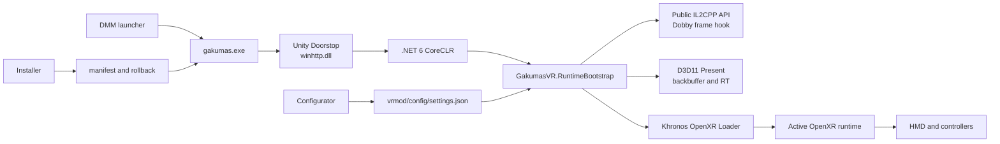

[한국어](../ko/ARCHITECTURE.md) | [English](ARCHITECTURE.md) | [日本語](../ja/ARCHITECTURE.md)

# Architecture

[Project home](../../README.en.md) · [Installation](INSTALLATION.md) · [Usage](USAGE.md)

## System overview

Unity Doorstop starts .NET 6 inside the game process and loads `GakumasVR.RuntimeBootstrap`. The bootstrap uses GameAssembly's public IL2CPP API instead of generated BepInEx interop assemblies. Dobby hooks establish Unity main-thread and D3D11 Present boundaries. Frames are submitted through the Khronos OpenXR Loader to the runtime selected by the user.

## Rendering paths

| Context | VR output | UI and video |
|---|---|---|
| Supported 3D environment | Left/right clone cameras and an OpenXR Projection Layer | Final game backbuffer copied to the hand panel |
| Fully 2D environment | Front OpenXR Quad Layer in a black reference space | Entire final backbuffer shown with preserved aspect ratio |
| Error or unsupported context | No stereo submission; flat fallback | The desktop game keeps running |

While fresh 3D eye textures are being produced, the projection world is displayed. If fresh stereo stops, the runtime removes the last 3D frame and switches to the current game backbuffer on the front panel. The hand panel reuses its own swapchain; when it is off or outside view, the GPU copy and quad submission are skipped.

## Input path

The OpenXR Oculus Touch action profile supplies hand/aim poses, Grip, Trigger, A/B/X/Y, and Thumbstick state. The pointer ray is intersected with the currently visible panel, converted to game-client coordinates, and delivered as Windows input. Panel and pointer hands must differ and can be swapped in settings.

6DoF navigation decomposes and rebuilds the pose from roll-free scene yaw/pitch, separately accumulated stick yaw/pitch, and HMD yaw/pitch/roll deltas since origin capture. By default, the left stick performs 15° world-axis snap turns and the right stick moves along the full final 3D view; settings can swap the roles. The stick cannot create roll, while actual physical HMD roll delta remains visible. See the [VR interaction and pose-composition specification](VR_INTERACTION_SPEC.md) for the portable math, input, and lifetime contract.

## Installation safety

The installer verifies relative paths and SHA-256 hashes from the package manifest and writes only contained paths under the selected game directory. Existing targets are backed up under `vrmod/rollback/`. During uninstall, only files that still match their installed hash are deleted or restored; modified files are preserved with a warning.

Protected data includes:

- `GameAssembly.dll`, `UnityPlayer.dll`, and original game assets
- Localify's `version.dll`, `gakumas-local/` translations, fonts, textures, and settings
- User `vrmod/config/settings.json`
- Account identifiers and authentication data

## Repository layout

- `vrmod/src/GakumasVR.RuntimeBootstrap/`: IL2CPP, D3D11, and OpenXR runtime
- `vrmod/src/GakumasVR.Core/`: settings and runtime-independent state logic
- `vrmod/src/GakumasVR.Configurator/`: desktop settings UI
- `vrmod/src/GakumasVR.Installer/`, `vrmod/src/GakumasVR.Management/`: installer UI and safe installation engine
- `vrmod/installer/`: packaging and PowerShell installation interfaces
- `vrmod/tests/`: Core and Management regression tests
- `docs/`: user documentation and development status/design/handoff records

See [`vrmod/README.md`](../../vrmod/README.md) for development commands and [`docs/GAKUMAS_VR_DESIGN.md`](../GAKUMAS_VR_DESIGN.md) for the detailed design record (both in Korean).
