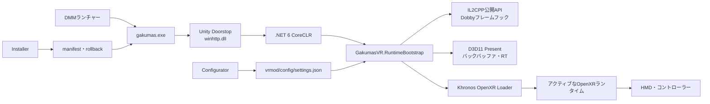

[한국어](../ko/ARCHITECTURE.md) | [English](../en/ARCHITECTURE.md) | [日本語](ARCHITECTURE.md)

# 構成と仕組み

[プロジェクトホーム](../../README.ja.md) · [インストール](INSTALLATION.md) · [使い方](USAGE.md)

## 全体構成

Unity Doorstopがゲームプロセス内で.NET 6を起動し、`GakumasVR.RuntimeBootstrap`を読み込みます。Bootstrapは生成されたBepInEx interop DLLに依存せず、GameAssemblyの公開IL2CPP APIを利用します。DobbyフックでUnityメインスレッドとD3D11 Presentの境界を取得し、Khronos OpenXR Loaderを通じて選択されたランタイムへフレームを送信します。

## レンダー経路

| 場面 | VR出力 | UI・動画 |
|---|---|---|
| 対応3D環境 | 左右のclone cameraとOpenXR Projection Layer | 最終ゲームバックバッファを手元パネルへコピー |
| 完全な2D環境 | 黒い参照空間の正面OpenXR Quad Layer | 最終バックバッファ全体をアスペクト比維持で表示 |
| エラー／未対応場面 | ステレオを送信せず平面へフォールバック | PC側ゲームは動作を継続 |

新しい3D eye textureが生成されている間はprojection worldを表示します。新しいステレオが止まると最後の3Dフレームを残さず、現在のゲームバックバッファを正面パネルに表示します。手元パネルは専用swapchainを再利用し、OFFまたは視野外ならGPUコピーとquad送信を省略します。

## 入力経路

OpenXR Oculus Touch action profileから手／aim pose、Grip、Trigger、A/B/X/Y、Thumbstickを取得します。ポインターrayと表示中パネルの交点をゲームのclient座標へ変換し、Windows入力として送ります。パネル側とポインター側の手は異なる必要があり、設定で交換できます。

6DoF navigationは、rollを除去したシーンyaw/pitch、別に累積したスティックyaw/pitch、原点取得後のHMD yaw/pitch/roll差分を分解・再合成します。独立ライブ6DoFはデフォルトONです。左スティックは30°ワールド軸snap、右スティックは1.95m/sで最終3D視点方向へ移動し、設定から役割を交換できます。スティックはrollを生成できず、実際のHMD roll差分だけが最終画面に残ります。移植可能な数式・入力・寿命契約は[VR操作・ポーズ合成仕様](VR_INTERACTION_SPEC.md)を参照してください。

## インストールの安全性

インストーラーはpackage manifestの相対パスとSHA-256を検証し、選択したゲームフォルダー内の限定されたパスだけへ書き込みます。既存ファイルは`vrmod/rollback/`へバックアップします。アンインストール時はインストール時のハッシュと一致するファイルだけを削除・復元し、変更済みファイルは警告して保持します。

保護対象:

- `GameAssembly.dll`、`UnityPlayer.dll`、ゲーム本体のアセット
- Localifyの`version.dll`、`gakumas-local/`の翻訳・フォント・テクスチャ・設定
- ユーザーの`vrmod/config/settings.json`
- アカウント識別子と認証情報

## リポジトリ構成

- `vrmod/src/GakumasVR.RuntimeBootstrap/`: IL2CPP、D3D11、OpenXRランタイム
- `vrmod/src/GakumasVR.Core/`: 設定とランタイム非依存の状態ロジック
- `vrmod/src/GakumasVR.Configurator/`: デスクトップ設定UI
- `vrmod/src/GakumasVR.Installer/`、`vrmod/src/GakumasVR.Management/`: インストーラーUIと安全な管理エンジン
- `vrmod/installer/`: パッケージ作成とPowerShellインストール操作
- `vrmod/tests/`: Core／Management回帰テスト
- `docs/`: ユーザー文書、開発状況、設計、引き継ぎ記録

開発コマンドは[`vrmod/README.md`](../../vrmod/README.md)、詳しい設計記録は[`docs/GAKUMAS_VR_DESIGN.md`](../GAKUMAS_VR_DESIGN.md)を参照してください（韓国語）。
