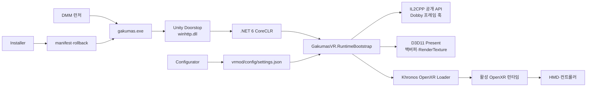

[한국어](ARCHITECTURE.md) | [English](../en/ARCHITECTURE.md) | [日本語](../ja/ARCHITECTURE.md)

# 프로그램 구조와 동작 방식

[프로젝트 홈](../../README.md) · [설치 방법](INSTALLATION.md) · [사용 방법](USAGE.md)

## 전체 구조

Unity Doorstop이 게임 프로세스에서 .NET 6 런타임을 시작하고 `GakumasVR.RuntimeBootstrap`을 로드합니다. 부트스트랩은 생성된 BepInEx interop DLL에 의존하지 않고 GameAssembly의 공개 IL2CPP API로 Unity 객체를 다룹니다. Dobby 훅으로 Unity 메인 스레드와 D3D11 Present 경계를 확보하고 Khronos OpenXR Loader를 통해 사용자가 선택한 런타임에 프레임을 제출합니다.

## 렌더 경로

| 문맥 | VR 출력 | UI·영상 |
|---|---|---|
| 지원되는 3D 환경 | 원본 카메라에서 만든 좌·우 clone 카메라와 OpenXR Projection Layer | 최종 게임 백버퍼를 손 패널로 복사 |
| 완전한 2D 환경 | 검은 참조 공간의 정면 OpenXR Quad Layer | 최종 게임 백버퍼 전체를 비율 보존 표시 |
| 오류·미지원 문맥 | 스테레오를 제출하지 않고 평면 폴백 | 게임 창은 계속 실행 |

3D 눈 텍스처가 새로 생산되는 동안은 projection world를 표시합니다. 새 스테레오 프레임이 없으면 마지막 3D 프레임을 남기지 않고 최신 게임 백버퍼를 정면 패널로 전환합니다. 손 패널은 별도 swapchain을 재사용하며 꺼져 있거나 손이 시야 밖이면 GPU 복사와 quad 제출을 생략합니다.

## 입력 경로

OpenXR Oculus Touch action profile에서 손 pose, aim pose, Grip, Trigger, A/B/X/Y와 Thumbstick을 읽습니다. 포인터 ray와 표시 중인 패널 평면의 교차점을 게임 client 좌표로 변환하고 Windows 입력으로 전달합니다. 포인터 손과 패널 손은 서로 달라야 하며 설정에서 교체할 수 있습니다.

6DoF navigation은 게임 카메라의 roll을 제거한 월드 yaw/pitch, 별도 누적한 스틱 yaw/pitch, 원점 이후 HMD yaw/pitch/roll 변화량을 분해해 재합성합니다. 기본 왼손은 15° 월드축 스냅 회전, 오른손은 최종 시야 방향의 3D 이동이며 설정에서 역할을 교체합니다. 스틱은 roll을 만들 수 없고 실제 HMD roll 변화량만 최종 화면에 반영됩니다. 이식 가능한 수학·입력·수명 계약은 [VR 조작·포즈 합성 명세](VR_INTERACTION_SPEC.md)에 정리되어 있습니다.

## 설치와 파일 보호

설치기는 패키지 manifest의 상대 경로와 SHA-256을 검증하고 게임 폴더 안으로 제한된 파일만 설치합니다. 기존 대상 파일은 `vrmod/rollback/`에 백업합니다. 제거할 때는 설치 당시 해시가 그대로인 파일만 삭제·복원하며 변경된 파일은 보존하고 경고합니다.

다음 항목은 보호 대상입니다.

- `GameAssembly.dll`, `UnityPlayer.dll`, 게임 원본 에셋
- Localify의 `version.dll`, `gakumas-local/` 번역·폰트·텍스처·설정
- 사용자 `vrmod/config/settings.json`
- 계정 식별자와 인증 정보

## 저장소 구성

- `vrmod/src/GakumasVR.RuntimeBootstrap/`: IL2CPP, D3D11, OpenXR 런타임
- `vrmod/src/GakumasVR.Core/`: 설정과 런타임 독립 상태 로직
- `vrmod/src/GakumasVR.Configurator/`: 데스크톱 설정 GUI
- `vrmod/src/GakumasVR.Installer/`, `vrmod/src/GakumasVR.Management/`: 설치 GUI와 안전한 설치 엔진
- `vrmod/installer/`: 패키지 작성 및 PowerShell 설치 인터페이스
- `vrmod/tests/`: Core·Management 회귀 테스트
- `docs/`: 사용자 문서와 개발 상태·설계·인수인계 기록

더 자세한 개발 방법은 [`vrmod/README.md`](../../vrmod/README.md), 결정 근거는 [`docs/GAKUMAS_VR_DESIGN.md`](../GAKUMAS_VR_DESIGN.md)를 참고하십시오.
